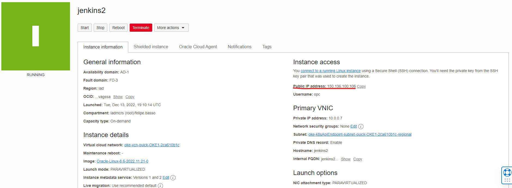
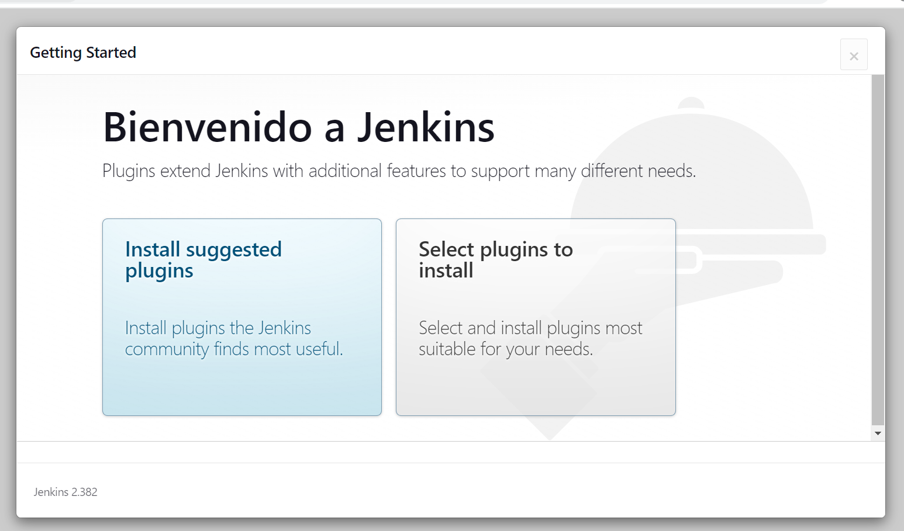
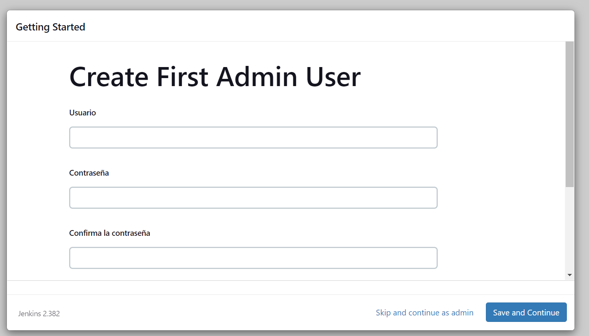
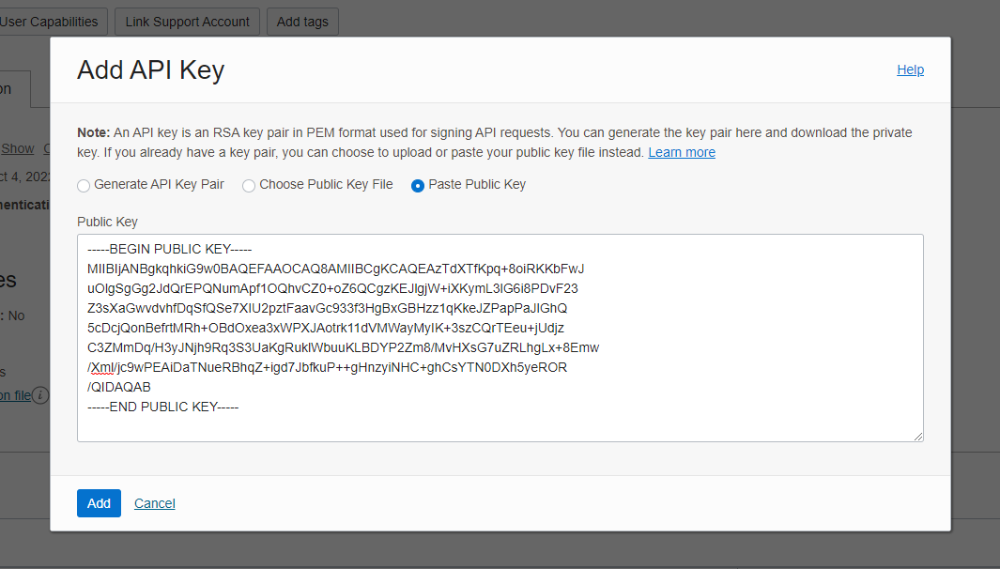
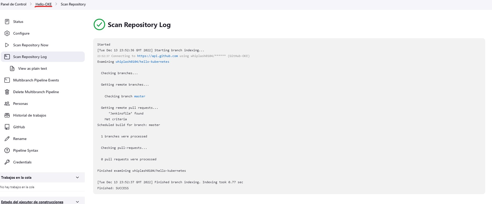
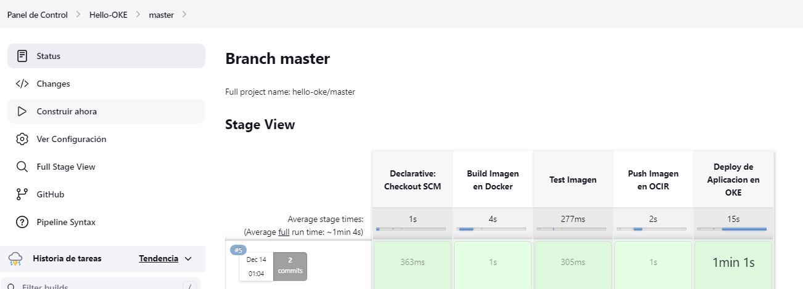

## CI/CD en Oracle Kubernetes Engine Utilizando Jenkins

La finalidad de este demo es configurar Jenkins para realizar deploymente de una aplicaicón en Oracle Kubernetes Engine (OKE)

### Requerimientos:

- Cuenta de Oracle Cloud Infrastructure(test gratuito https://www.oracle.com/cloud/free/)
- Putty ssh, o cualquier cliente ssh que se utilice (Validar versión de sistema operativo y descargar https://www.chiark.greenend.org.uk/~sgtatham/putty/latest.html)
- Cuenta de Github (https://github.com/signup?ref_cta=Sign+up&ref_loc=header+logged+out&ref_page=%2F&source=header-home)

### Aclaraciones:
- XXXXXX Corresponde a varibale que debe ser modificada en base a la que cada uno posee}
- En honor al tiempo:
	- No se integrará Jenkins con ninguna plataforma de inspeción de código como por ejemplo SonarQube o CodeScan
	- No se realizará integración derecta de Jenkins con Kubernetes 
	- No se utilizará ningún compilador como por ejemplo Gradle o Maven
	- No se creará directamente el repositorio de Helm
	- No se configurará webhook entre GitHub y Jenkins
- Si nos alcanza el tiempo podremos trabajar con GitHub Action

### ¿Qué vamos a hacer?

- Instalar/Configurar OKE
- Instalar y Configurar Jenkins
- Instalación Helm
- Clonar repositorio Github
- Despliegue de aplicación
	- Descargar imágen desde dockerhub
	- Crear imágen personalizada de contenedor (compilar)
	- Subirla a OCI registry
	- Instalar app desde Helm
	- Despliegue en Kubernetes
- Modificar aplicación
- Despliegue automático 

### Paso a Paso OKE
**Crear Compartment**

Menú -> Identity & Security -> Compartmente -> New Compartment

	CAMPO				VALOR
	==============================================
	Name		 		OKE
	Description 			OKE
	Parent Compartment 		XXXX (root)

https://user-images.githubusercontent.com/14284928/208510305-49f90928-422e-4b57-b05a-b3349ee4a5e2.mov

**Creación de VCN**

Menú > Networking > Virtual Cloud Network > Start VCN Wizard > Start VCN Wizard

Dentro de la configuración definir

	CAMPO				VALOR
	=============================================
	VNC Name:			VNC-OKE
	Compartment:			OKE
	
Click en Next

Validar Resumen y hacer click en Create

https://user-images.githubusercontent.com/14284928/208511358-295cd06b-c703-45db-a5cb-1e8461632284.mov

**Crear cluster OKE, dentro del compartment OKE y nombrarlo cluster1**

Menú -> Developer Services -> Kubernetes Clusters (OKE)
**IMPORTATE: validar que todo se cree en compartment OKE, en el video de ejemplo se usa el compartment felipe.basso**
	
Create Cluster -> Quick Create 

	CAMPO				VALOR
	=============================================
	Name:				OKE

**El proceso de creación del cluster de OKE tarda aproximadamente 20 minutos. durante este periodo, crear el servidor virtual de Jenkins**

https://user-images.githubusercontent.com/14284928/208512993-109e0539-c0f1-403b-8ba3-8d69eb7375fe.mov

Menú > Compute > Instances > Create Instance
Dentro de esta configuración se debe definir
	
	CAMPO				VALOR
	================================================================
	Name:				jenkins
	Create in compartment:		OKE
	Availability domain:		El que esté disponible
	Image and shape, Image:		Oracle Linux 8
	Shape:				VM.Standard.E4.Flex
	Virtual cloud network in OKE:	VNC-OKE
	Subnet in OKE:			Public Subnet-VNC-OKE (regional)
	Public IPv4 address:		Assign a public IPv4 address

**IMPORTANTE: SIN ESTE PUNTO NO TENRÁN ACCESO AL SERVIDOR JENKINS POR SSH**

	Add SSH keys:			Generate a key pair for me
	Hacer click en Save private key y en Save public key y guardarlas en un directorio conocido, se utilizarán después

	Finalmente, click en Create
	
https://user-images.githubusercontent.com/14284928/208521618-8da386d4-160f-4f28-a9eb-02949ae9765d.mov

	
Una vez que el servidor Jenkins esté creado, copiar la ip pública

**Configurar la llave privada para ser compatible con putty**

	Abrir el programa "puttyGen" > Conversions > Import Key
	Cargar la llave privada y click en "Save private key" sin passhrase, click en "Yes"
	Almacenarla con el nombre "private.ppk", finalmente cerrar puttyGen

https://user-images.githubusercontent.com/14284928/208518198-221e5e35-53ec-4580-9d1c-569e105ef5dc.mov

**Abrir y configurar Putty para que use la llave ssh creada y descargada desde OCI**

	Abrir putty y en el campo "Host Name (or IP address)" pegar la ip pública del servidor Jenkins creado
	

Para realizar la conexión, se debe cargar el certificado privado ssh recientemente creado 

	En el menú izquierdo ir a Connection > + SSH > Auth > Browse...
	Realizar la conexión haciendo click en "Open"
	Cuando se abra la consola aceptar el certificado click en "Accept" y realizar login con el usuario "opc"

https://user-images.githubusercontent.com/14284928/208522277-9ab3163f-86ba-4510-a60a-194680999c52.mov

**Instalación de paquetes Jenkins**

	$ sudo yum upgrade -y
	$ sudo yum install java -y
	$ sudo wget -O /etc/yum.repos.d/jenkins.repo http://pkg.jenkins-ci.org/redhat/jenkins.repo
	$ sudo rpm --import https://jenkins-ci.org/redhat/jenkins-ci.org.key
	$ sudo yum install jenkins -y
	$ sudo systemctl enable --now jenkins

**Abrir los puertos de firewall**

	$ sudo firewall-cmd --zone=public --permanent --add-port=8080/tcp && sudo firewall-cmd --reload

**Instalación de Git**

	$ sudo yum install git -y
	
**Instalación de Docker

	$ sudo yum install docker -y

**Instalación de kubectl**

	$ curl -LO "https://dl.k8s.io/release/$(curl -L -s https://dl.k8s.io/release/stable.txt)/bin/linux/amd64/kubectl"
	$ sudo install -o root -g root -m 0755 kubectl /usr/local/bin/kubectl
	$ sudo cp -p /usr/local/bin/kubectl /usr/bin/
	$ kubectl version --client

**Para ejecutar contenedores, se debe ejecutar con root no con sudo**

	$ sudo su -
	# echo jenkins:10000:65536 >> /etc/subuid
	# echo jenkins:10000:65536 >> /etc/subgid
	# echo "jenkins  ALL=(ALL)       NOPASSWD:ALL" >> /etc/sudoers
	# exit
	logout
	$

**Instalar Helm**

	$ wget https://get.helm.sh/helm-v3.10.2-linux-amd64.tar.gz
	$ tar -xzvf helm-v3.10.2-linux-amd64.tar.gz
	$ sudo mv linux-amd64/helm /usr/bin/helm

**Instalación de oci cli**

	$ sudo yum install python36-oci-cli -y
	
https://user-images.githubusercontent.com/14284928/208525750-cf609166-4288-49dc-94d6-f147035c3d7c.mov

**Abrir puerto 8080 desde ecurity List**

Desde Menú > Networking > Virtual Cloud Networks > VNC-OKE > Security Lists > Default Security List for VNC-OKE > Add Ingress Rule y Modificar solo

	Source CIDR:			0.0.0.0/0
	Destination Port Range:		8080
	Description:			Jenkins Service

https://user-images.githubusercontent.com/14284928/208526110-6ebf2524-bd84-4089-a189-fcdd63987c57.mov

**Una vez abierto el puerto 8080 entrar desde el navegador a Jenkins, usando la ip pública y el puerto 808**
	
	Ejemplo: http://129.213.108.202:8080/
	
**Usar la password de admin que viene en ya predefinida**

	$ sudo cat /var/lib/jenkins/secrets/initialAdminPassword

**Instalar los plugins Sugeridos**

El proceso de instalación se iniciará

Se debe definir un nombre de usuario, contraseña y un correo

Finalmente Jenkins está instalado y listo para ser usado

https://user-images.githubusercontent.com/14284928/208526660-45f26de8-e523-4ac5-ac07-5b86bd4e567c.mov

**Una vez que finalice el proceso de creación de cluster OKE, conectar el nuevo servidor Jenkins a OKE**

Menú > Developer Services > Kubernetes Clusters (OKE) > Click en el Cluster OKE > Access Cluster > Cloud Shell Access > Local Access 

Seguir los pasos indicados en la conexión en el servidor Jenkins

	$ oci -v
	$ mkdir -p $HOME/.kube

Copiar el comando en el punto 2 (To access the kubeconfig for your cluster via the VCN-Native public endpoint, copy the following command) y ejecutar en el servidor Jenkins

Completar con ls sigueinte información

	Do you want to create a new config file? [Y/n]:							**ENTER**
	Do you want to create your config file by logging in through a browser? [Y/n]:			**ENTER**
	Enter a location for your config [/home/opc/.oci/config]:					**ENTER**
	Enter a user OCID: 										**Profile -> oracleidentitycloudservice/XXXXX -> OCID -> Copy**
	Enter a tenancy OCID:										****Profile -> Tenancy:XXXXX -> OCID -> Copy**
	Enter a region by index or name(e.g.....							**Esta aparece en la esquina superior derecha ej: US East (Ashburn), en este caso la región es Ashburn, se utiliza us-ashburn-1
	Do you want to generate a new API Signing RSA key pair? ... [Y/n]:				**ENTER**
	Enter a directory for your keys to be created [/home/opc/.oci]:					**ENTER**
	Enter a name for your key [oci_api_key]:							**ENTER**
	Enter a passphrase for your private key (empty for no passphrase):				**ENTER**

Una vez realizada la configuración crear un API Key
	
	Menú > Identity & Security > Users > Tu usuario > Api Key > Add API Key
	Selecionar la opción "Paste Public Key" y pegar la llave pública creada en el paso anterior
	
	$  cat /home/opc/.oci/oci_api_key_public.pem

La creación de esta API Key generará un finguerprint, el cual debe coincidir con el que se creó en el paso anterior, para validar copiar el fingerprint creado y buscarlo en el archivo de configuración creado

	$ fgrep "XX:XX:XX:XX:XX:XX:XX:XX" /home/opc/.oci/config

Volver a Menú > Developer Services > Kubernetes Clusters (OKE) > Click en el Cluster OKE > Access Cluster > Cloud Shell Access > Local Access 

Y copiar el comando del punto 2 (To access the kubeconfig for your cluster via the VCN-Native public endpoint, copy the following command) y ejecutar en el servidor Jenkins, este creará la confinguración de Kubernetes

Crear Token (Nos permitirá conectarnos con el OCI Registry)

	Menu -> Identity & Security -> User -> Tu Usuario -> Auth Tokens -> Generate Token
	Description: jenkins-oke

Se puede guardar dentro de un archivo llamado token, **Reemplazar XXXX por el token de cada uno**

	$ echo "XXXXXX" > $HOME/.oci/token

**Crear namespace hello-oke**

	$ kubectl create namespace hello-oke
	
**Crear registry en OCI y nombrarlo hello_oke Validar que se cree en compartment OKE**

Menu -> Developer Services -> Container Registry -> Create Repository

	CAMPO			VALOR
	====================================
	Repository Name:	hello_oke

https://user-images.githubusercontent.com/14284928/208528707-5a04d6b5-134d-4c17-b626-8878e1267a1f.mov

Guardar el nombre del namespace del registry para su futuro uso

	$ echo "XXXXX" > $HOME/.oci/namespaceRegistry

https://user-images.githubusercontent.com/14284928/208528723-5777bf61-ac09-43ab-9e3b-40319528a9da.mov

**Crear Secret en namespace hello-oke**

	$ kubectl create secret docker-registry ocirsecret --docker-server=XXX_REGION.ocir.io --docker-username='XXX_REGISTRYNAMESPACE/oracleidentitycloudservice/XXX_USER' --docker-password='XXX_TOKEN' -n hello-oke
secret/ocirsecret created

Donde
	XXX_REGION: 			es la reción donde vive el cluster de OKE
	XXX_REGISTRYNAMESPACE:		Es el namespace del registry creado en el paso anterior, cat $HOME/.oci/namespaceRegistry
	XXX_USER:			Usuario con el que nos conectamos
	XXX_TOKEN:			Token creado y almacenado en $HOME/.oci/token

**Crear nuevo repositorio en GitHub, nombrarlo ghithubaction-oke y dejarlo de forma pública**

	Profile -> Your Repositories -> New -> Repository Name -> Create Repository
	
**Una vez creado el nuevo repositorio, ir a la opción "…or import code from another repository" e importar el código de la URL**
	
	https://github.com/whiplash0104/jenkins-OKE.git

https://user-images.githubusercontent.com/14284928/208529078-34df87b7-ca30-43f4-b004-943fbc8f272a.mov

**Modificar en GGitHub archivo XXX_REPOSITORIO/hello-oke/hello-oke.yaml, cambiar XXX_REPOSITORIO por el nombre del repositorio creado**
Cambiar línea 8  

	8  repository: XXX_REGION.ocir.io/XXX_REGISTRYNAMESPACE/hello_oke
	
	Donde:
		XXX_REGION es la región donde vive el cluster
		XXX_REGISTRYNAMESPACE es el namespace del registry creado   
			cat $HOME/.oci/namespaceRegistry

**Modificar Jenkinsfile**

Dentro del repositorio clonado modificar el archivo Jenkinsfile
	TOKEN = 'XXXXXXXXXXXXXXXXXXXX'								$ cat $HOME/.oci/token
	REGISTRY_NAMESPACE = 'XXXXXXXXXXXXXXXXXXXX'						$ cat $HOME/.oci/namespaceRegistry
	OCIUSER = ${REGISTRY_NAMESPACE}/oracleidentitycloudservice/XXXXXXXXXXXXXXXXXXXX		Usuario: Menú > Identity & Security > Users > Tu Usuario Copiar el nombre completo del usuario, en mi caso es oracleidentitycloudservice/felipeXXXXX
        REGION = XXX								Este identificador se obtiene desde https://docs.oracle.com/en-us/iaas/Content/General/Concepts/regions.htm ej: para chile es scl, por ende la región es scl.ocir.io, para Sao Paulo es gru, por ende la región es gru.ocir.io
	
El resto de los parámetros dejarlos de la misma forma

        IMAGE = 'hello_oke'
        IMAGE_TAG = 'latest'
        REGISTRY_TAG = "${REGION}.ocir.io/${REGISTRY_NAMESPACE}/${IMAGE}:${IMAGE_TAG}"
        OCINAMESPACE = 'hello-oke'
        DEP_YAML = 'hello-oke.yaml''

**Integrar Jenkins con gitHub**

	Ir al menú izquierdo y selecionar la opción Administrar Jenkins
	Luego ir a Manage Credentials
	Hacer click en System
	Hacer click en Global credentials (unrestricted)
	Y click en "+ Add Credential" y selecionar la opción "Username with password"

		Username:			Usuario de GitHub
		Password:			Password de GitHub
		ID:				GitHub-OKE
		Description:			GitHub-OKE
	Click en "Create"

https://user-images.githubusercontent.com/14284928/208529487-9c860a13-6fdd-43ea-aac0-93b9f162b876.mov

**Crear Tarea en Jenkins**

Menú > + Nueva Tarea 
	Nombrar como hello-oke
	Selecionar la opción Multibranch Pipeline
	Click en OK

	Definir los siguientes parámetros

		Display Name:				Hello-OKE
		Description:				Hello-OKE
		Branch Sources:				
			Add Source:			GitHub
			Credentials:			Selecionar las que fueron creadas recientemente
			Repository HTTPS URL:		Copiar la URL del repositorio Git que fue creado por cada uno, Menu > Repositories > Nombre del repo > Code > Https > Copiar URL, ver imagen URLRepoGit
			Click en Validate
		Click en Create

https://user-images.githubusercontent.com/14284928/208529805-c8491571-72b6-4ae7-97b3-9751baadfbfb.mov

Cuando se cree la tarea esta automáticamente realiza el scan del código. Si la integración se realizó de forma correcta, el escaneo del repositorio finalizará de forma correcta hacer click en Panel de Control > Hello-OKE (selecionado en rojo)

Si todo salió bien, se verá un la rama master en verde 

Al hacer click en la rama master se podrá ver pipeline en verde

Para validar, solo hayq eu conectarnos a la IP del service Load Balancer creado en el namespace hello-oke
Hay dos formas de saber la ip

	$ kubectl get service -n hello-oke

1. Lo que mostará como ejemplo

	NAME        TYPE           CLUSTER-IP      EXTERNAL-IP      PORT(S)        AGE
	hello-oke   LoadBalancer   10.96.146.146   132.226.43.126   80:31581/TCP   5m38s

2. Desde OCI Menú > Networking > Load Balancer

https://user-images.githubusercontent.com/14284928/208536782-02a7db11-49b9-4e4b-82f8-eaaf2b1c06a1.mov

