## CI/CD en Oracle Kubernetes Engine Utilizando Jenkins

La finalidad de este demo es configurar Jenkins para realizar deploymente de una aplicaicón en Oracle Kubernetes Engine (OKE)

### Requerimientos:

- Cuenta de Oracle Cloud Infrastructure(test gratuito https://www.oracle.com/cloud/free/)
- Putty ssh, o cualquier cliente ssh que se utilice (Validar versión de sistema operativo y descargar https://www.chiark.greenend.org.uk/~sgtatham/putty/latest.html)
- Cuenta de Github (https://github.com/signup?ref_cta=Sign+up&ref_loc=header+logged+out&ref_page=%2F&source=header-home)

### Aclaraciones:
- XXXXXX Corresponde a varibale que debe ser modificada en base a la que cada uno posee
- 

### ¿Qué vamos a hacer?

- Instalar/Configurar OKE
- Instalar y Configurar Jenkins
- Instalación Helm
- Clonar repositorio Github
- Despliegue de aplicación
	- Descargar imágen desde dockerhub
	- Crear imágen personalizada de contenedor (compilar)
	- Subirla a OCI registry
	- Instalar app desde Helm
	- Despliegue en Kubernetes
- Modificar aplicación
- Despliegue automático 

### Paso a Paso OKE
**Crear Compartment**

Menú -> Identity & Security -> Compartmente -> New Compartment

	CAMPO				VALOR
	==============================================
	Name		 		OKE
	Description 			OKE
	Parent Compartment 		XXXX (root)

**Creación de VCN**

Menú > Networking > Virtual Cloud Network > Start VCN Wizard > Start VCN Wizard
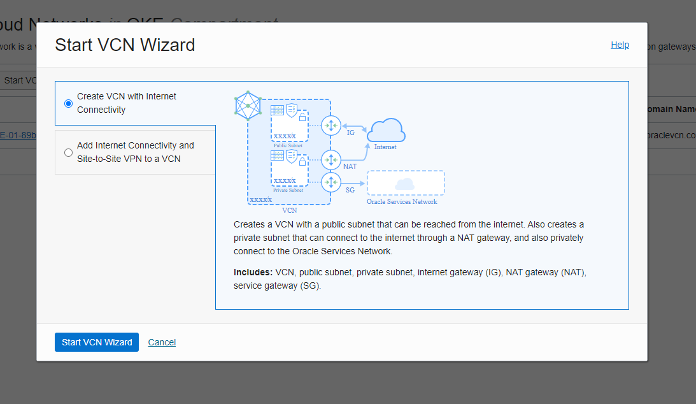

Dentro de la configuración definir
	
	VNC Name:			VNC-OKE
	Compartment:			OKE
	
Click en Next
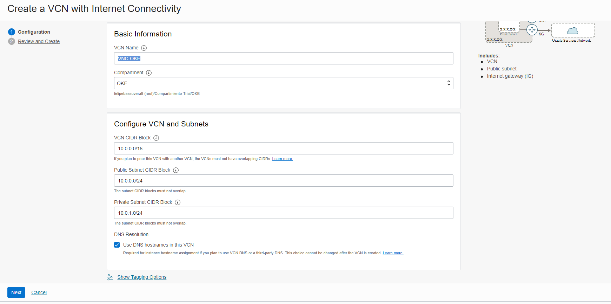

Validar Resumen y hacer click en Create
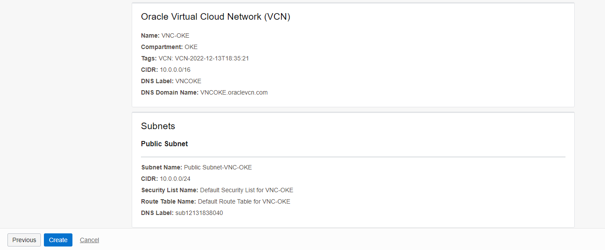

**Crear cluster OKE, dentro del compartment OKE y nombrarlo cluster1**

Menú -> Developer Services -> Kubernetes Clusters (OKE)
**IMPORTATE: validar que todo se cree en compartment OKE**
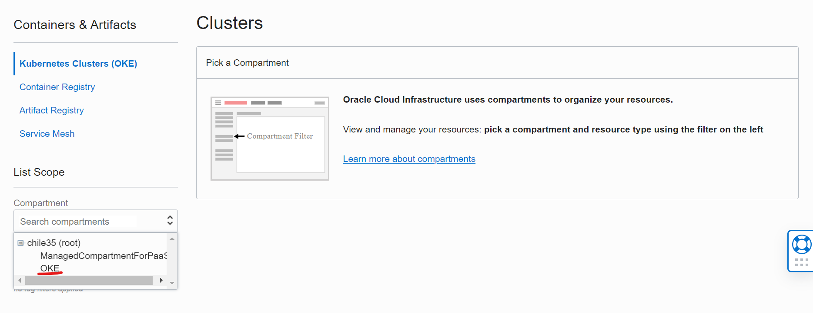
	
Create Cluster -> Quick Create 

**El proceso de creación del cluster de OKE tarda aproximadamente 20 minutos. durante este periodo, crear el servidor virtual de Jenkins**

Menú > Compute > Instances > Create Instance
Dentro de esta configuración se debe definir
	
	Name:				jenkins
	Create in compartment:		OKE
	Availability domain:		El que esté disponible
	Image and shape, Image:		Oracle Linux 8
	Shape:				VM.Standard.E4.Flex

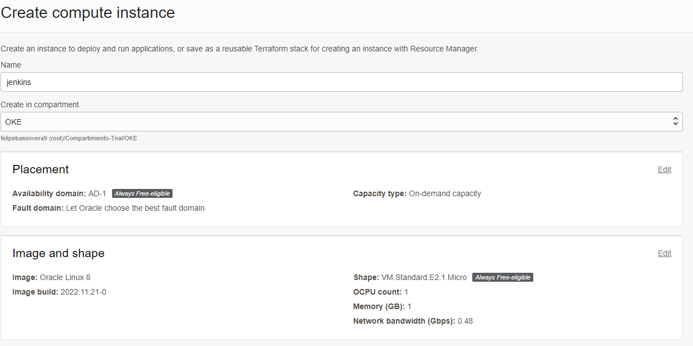

	Virtual cloud network in OKE:	VNC-OKE
	Subnet in OKE:			Public Subnet-VNC-OKE (regional)
	Public IPv4 address:		Assign a public IPv4 address

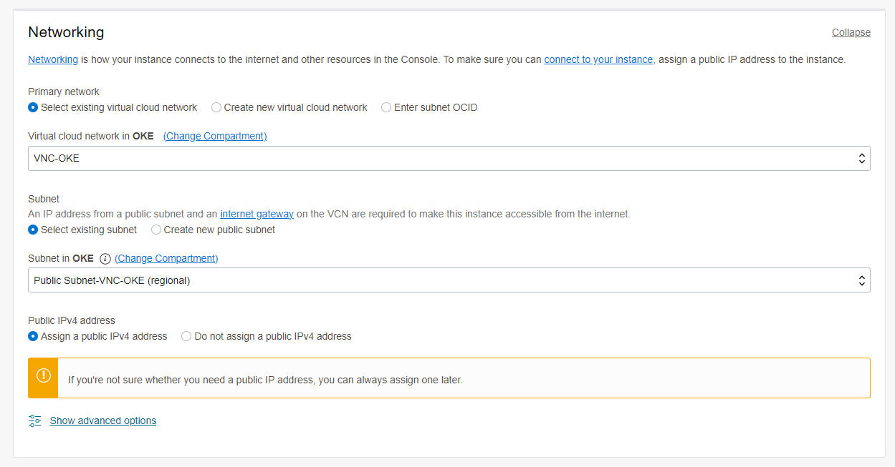

**IMPORTANTE: SIN ESTE PUNTO NO TENRÁN ACCESO AL SERVIDOR JENKINS POR SSH**

	Add SSH keys:			Generate a key pair for me
	Hacer click en Save private key y en Save public key y guardarlas en un directorio conocido, se utilizarán después

	Finalmente, click en Create
		
Una vez que el servidor Jenkins esté creado, copiar la ip pública

**Configurar la llave privada para ser compatible con putty**

	Abrir el programa "puttyGen" > Conversions > Import Key

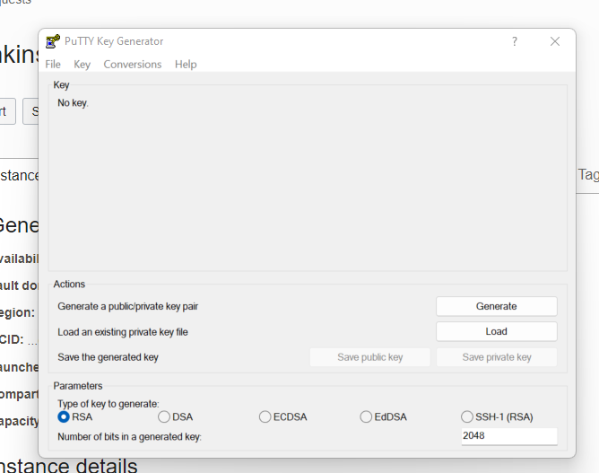

	Cargar la llave privada y click en "Save private key" sin passhrase, click en "Yes"

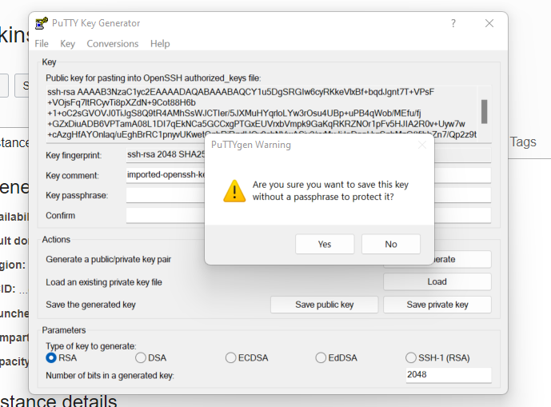

	Almacenarla con el nombre "private.ppk", finalmente cerrar puttyGen

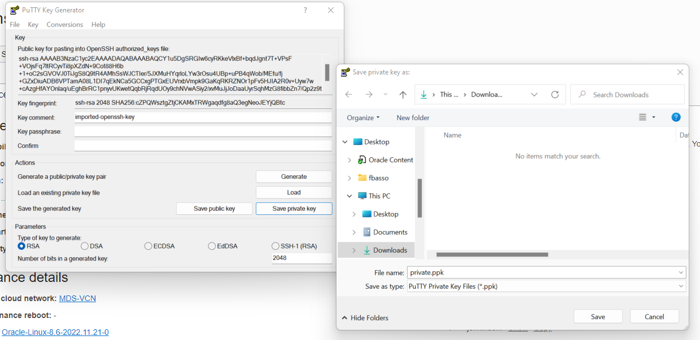

**Abrir y configurar Putty para que use la llave ssh creada y descargada desde OCI**

	Abrir putty y en el campo "Host Name (or IP address)" pegar la ip pública del servidor Jenkins creado
	
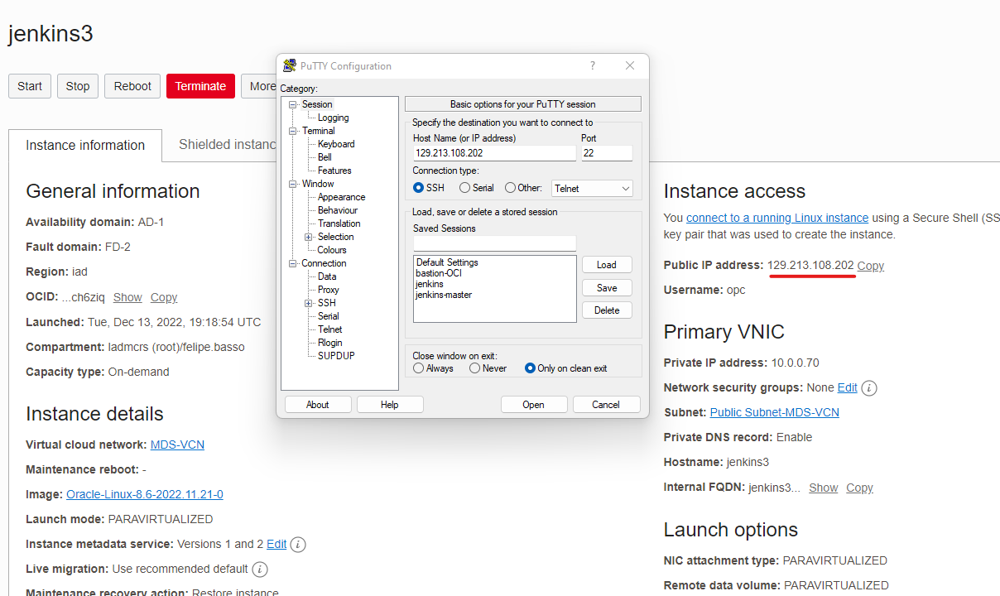

Para realizar la conexión, se debe cargar el certificado privado ssh recientemente creado 
	En el menú izquierdo ir a Connection > + SSH > Auth > Browse...

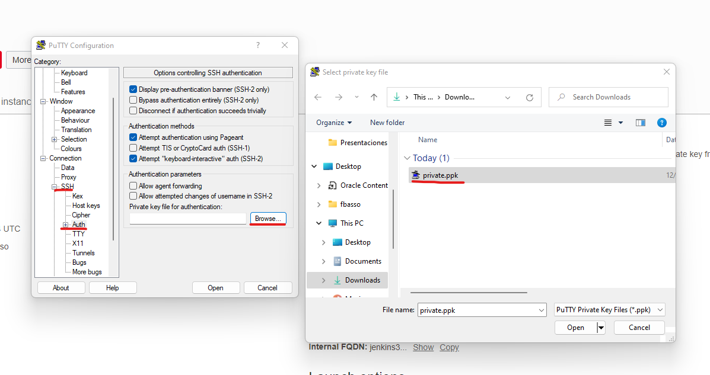

Finalmente realizar la conexión haciendo click en "Open"

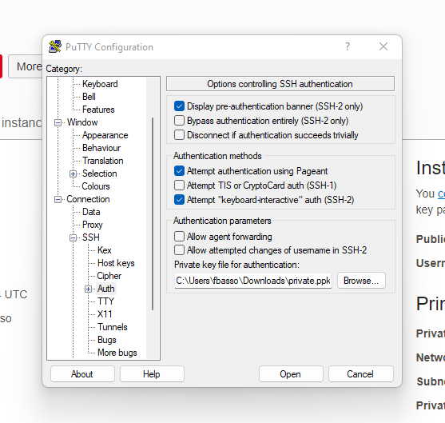

Cuando se abra la consola aceptar el certificado click en "Accept" y realizar login con el usuario "opc"
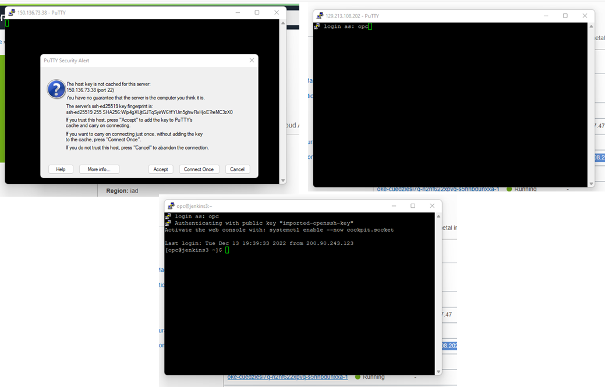

**Instalación de paquetes Jenkins**

	$ sudo yum upgrade -y
	$ sudo yum install java -y
	$ sudo wget -O /etc/yum.repos.d/jenkins.repo http://pkg.jenkins-ci.org/redhat/jenkins.repo
	$ sudo rpm --import https://jenkins-ci.org/redhat/jenkins-ci.org.key
	$ sudo yum install jenkins -y
	$ sudo systemctl enable --now jenkins

**Abrir los puertos de firewall**

	$ sudo firewall-cmd --zone=public --permanent --add-port=8080/tcp && sudo firewall-cmd --reload

**Instalación de Git**

	$ sudo yum install git -y

**Instalación de kubectl**

	$ curl -LO "https://dl.k8s.io/release/$(curl -L -s https://dl.k8s.io/release/stable.txt)/bin/linux/amd64/kubectl"
	$ sudo install -o root -g root -m 0755 kubectl /usr/local/bin/kubectl
	$ sudo cp -p /usr/local/bin/kubectl /usr/bin/
	$ kubectl version --client

**Para ejecutar contenedores, se debe ejecutar con root no con sudo**

	$ sudo su -
	# echo jenkins:10000:65536 >> /etc/subuid
	# echo jenkins:10000:65536 >> /etc/subgid
	# exit
	logout
	$

**Instalar Helm**

	$ wget https://get.helm.sh/helm-v3.10.2-linux-amd64.tar.gz
	$ tar -xzvf helm-v3.10.2-linux-amd64.tar.gz
	$ sudo mv linux-amd64/helm /usr/bin/helm

**Instalación de oci cli**

	$ sudo yum install python36-oci-cli -y

**Abrir puerto 8080 desde ecurity List**

Desde Menú > Networking > Virtual Cloud Networks > VNC-OKE > Security Lists > Default Security List for VNC-OKE > Add Ingress Rule y Modificar solo

	Source CIDR:			0.0.0.0/0
	Destination Port Range:		8080
	Description:			Jenkins Service

**Una vez abierto el puerto 8080 entrar desde el navegador a Jenkins, usando la ip pública y el puerto 808**
	
	Ejemplo: http://129.213.108.202:8080/
	
**Usar la password de admin que viene en ya predefinida**

	$ sudo cat /var/lib/jenkins/secrets/initialAdminPassword

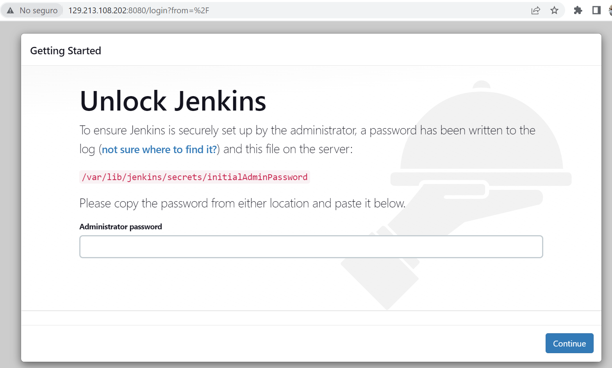

**Instalar los plugins Sugeridos**

El proceso de instalación se iniciará

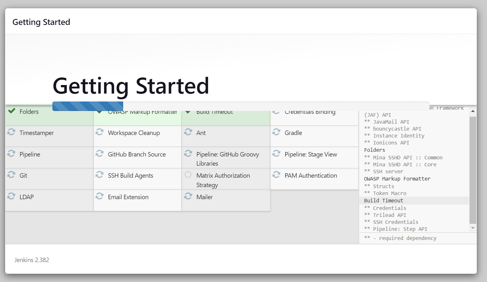

Se debe definir un nombre de usuario, contraseña y un correo

Finalmente Jenkins está instalado y listo para ser usado
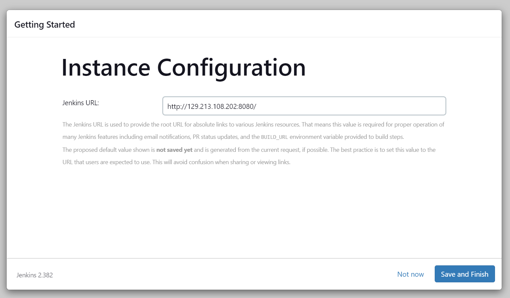

**Una vez que finalice el proceso de creación de cluster OKE, conectar el nuevo servidor Jenkins a OKE**

Menú > Developer Services > Kubernetes Clusters (OKE) > Click en el Cluster OKE > Access Cluster > Cloud Shell Access > Local Access 

Seguir los pasos indicados en la conexión en el servidor Jenkins

	$ oci -v
	$ mkdir -p $HOME/.kube

Copiar el comando en el punto 2 (To access the kubeconfig for your cluster via the VCN-Native public endpoint, copy the following command) y ejecutar en el servidor Jenkins

Completar con ls sigueinte información

	Do you want to create a new config file? [Y/n]:							**ENTER**
	Do you want to create your config file by logging in through a browser? [Y/n]:			**ENTER**
	Enter a location for your config [/home/opc/.oci/config]:					**ENTER**
	Enter a user OCID: 										**Profile -> oracleidentitycloudservice/XXXXX -> OCID -> Copy**
	Enter a tenancy OCID:										****Profile -> Tenancy:XXXXX -> OCID -> Copy**
	Enter a region by index or name(e.g.....							**Esta aparece en la esquina superior derecha ej: US East (Ashburn), en este caso la región es Ashburn, se utiliza us-ashburn-1
	Do you want to generate a new API Signing RSA key pair? ... [Y/n]:				**ENTER**
	Enter a directory for your keys to be created [/home/opc/.oci]:					**ENTER**
	Enter a name for your key [oci_api_key]:							**ENTER**
	Enter a passphrase for your private key (empty for no passphrase):				**ENTER**

Una vez realizada la configuración crear un API Key
	
	Menú > Identity > Users > Tu usuario > Api Key > Add API Key
	Selecionar la opción "Paste Public Key" y pegar la llave pública creada en el paso anterior
	
	$  cat /home/opc/.oci/oci_api_key_public.pem

La creación de esta API Key generará un finguerprint, el cual debe coincidir con el que se creó en el paso anterior, para validar copiar el fingerprint creado y buscarlo en el archivo de configuración creado

	$ fgrep "XX:XX:XX:XX:XX:XX:XX:XX" /home/opc/.oci/config
	
**Crear registry en OCI y nombrarlo hello_oke Validar que se cree en compartment OKE**

Menu -> Developer Services -> Container Registry -> Create Repository
	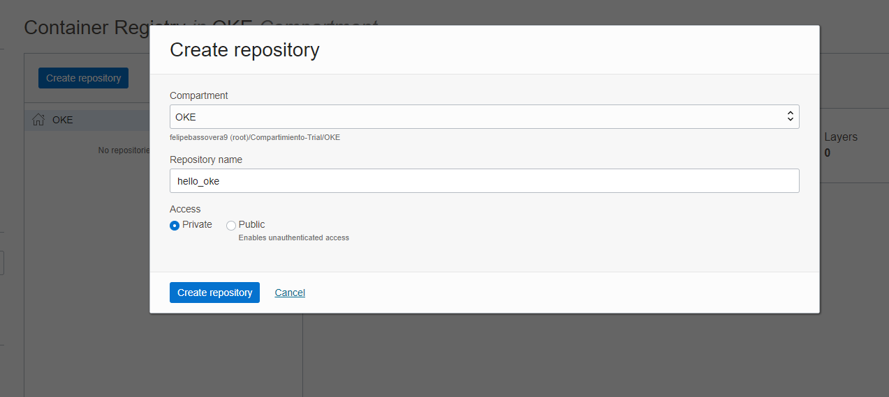
	
Guardar el nombre del namespace del registry para su futuro uso
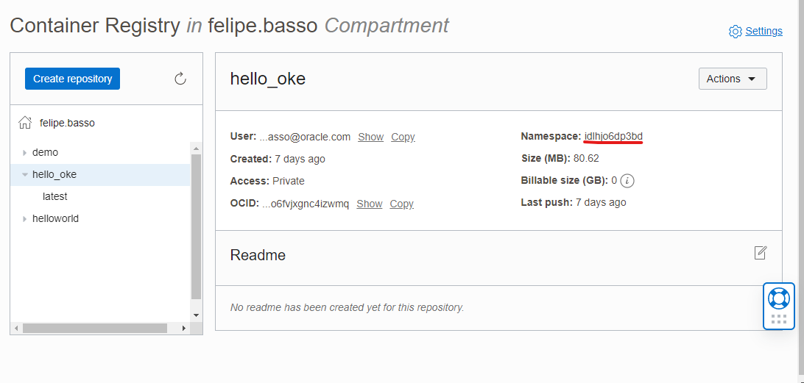

	$ echo "XXXXX" > ~/.oci/namespaceRegistry
	
**Crear nuevo repositorio en GitHub, nombrarlo ghithubaction-oke y dejarlo de forma pública**

	Profile -> Your Repositories -> New -> Repository Name -> Create Repository
	
**Una vez creado el nuevo repositorio, ir a la opción "…or import code from another repository" e importar el código de la URL**
	
	https://github.com/whiplash0104/hello-kubernetes.git

**Integrar Jenkins con gitHub**

Ir al menú izquierdo y selecionar la opción Administrar Jenkins
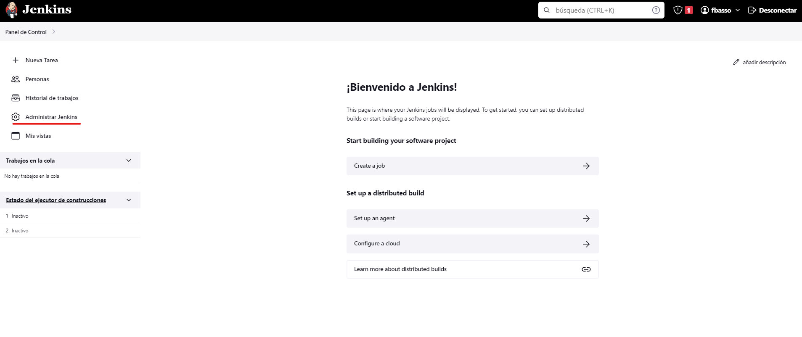

Luego ir a Manage Credentials
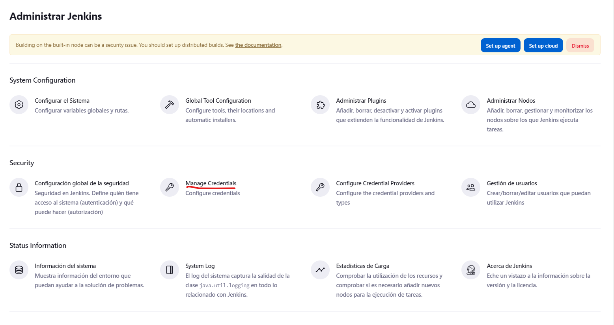

Hacer click en System

Hacer click en Global credentials (unrestricted)

Y click en "+ Add Credential" y selecionar la opción "Username with password"
	Username:			Usuario de GitHub
	Password:			Password de GitHub
	ID:				GitHub-OKE
	Description:			GitHub-OKE
Click en "Create"

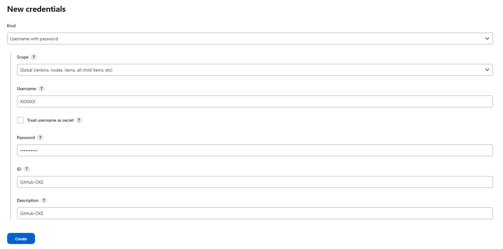

**Crear Tarea en Jenkins**

Menú > + Nueva Tarea 
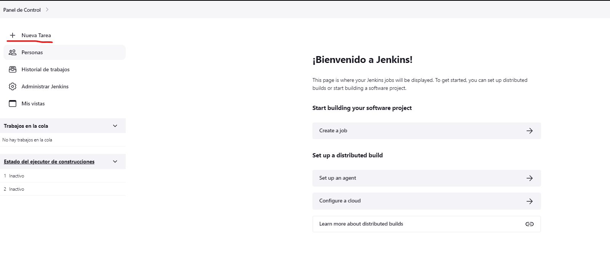

	Nombrar como hello-oke
	Selecionar la opción Multibranch Pipeline
	
	Click en OK

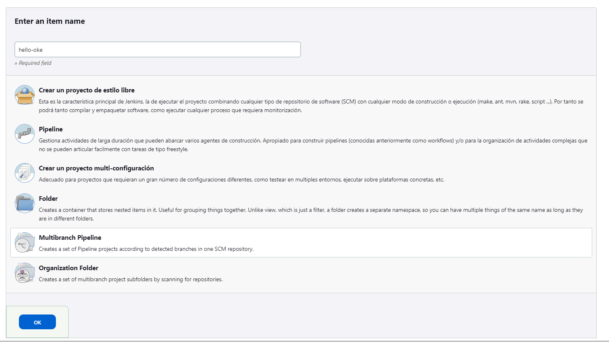

Definir los siguientes parámetros

	Display Name:				Hello-OKE
	Description:				Hello-OKE
	Branch Sources:				
		Add Source:			GitHub
		Credentials:			Selecionar las que fueron creadas recientemente
		Repository HTTPS URL:		Copiar la URL del repositorio Git que fue creado por cada uno, Menu > Repositories > Nombre del repo > Code > Https > Copiar URL, ver imagen URLRepoGit
		Click en Validate
	Click en Create

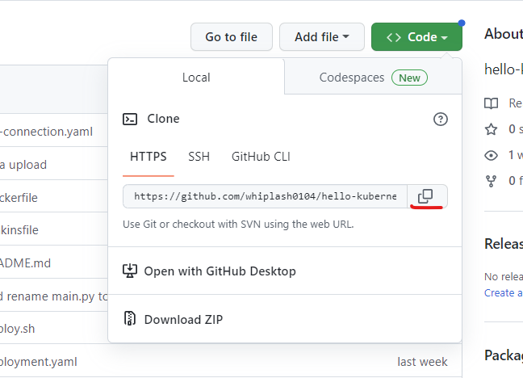
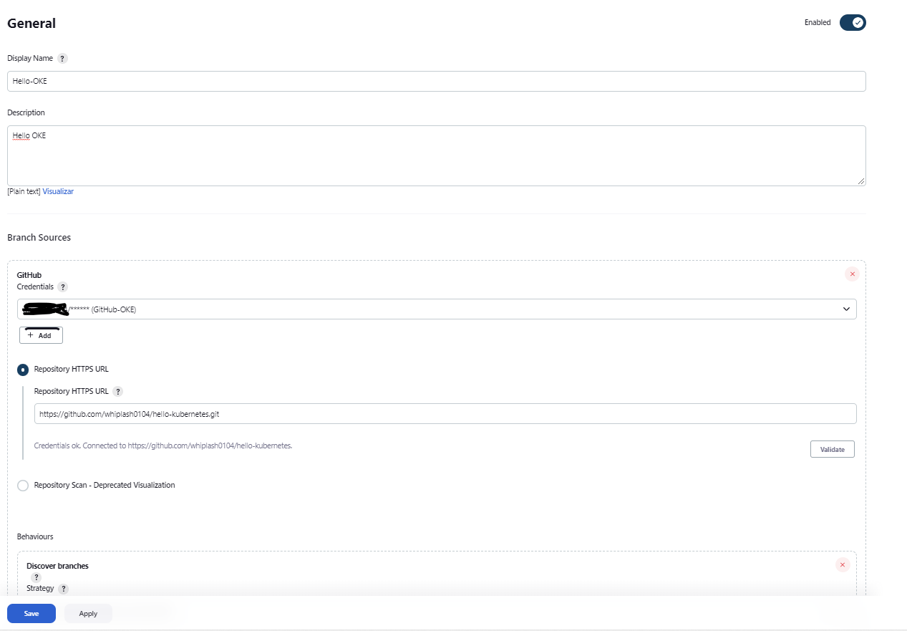

